# SecureShare

## Intelligent Decentralized Secure File Sharing System with Privacy-Preserving Access Control

SecureShare is a next-generation decentralized file sharing platform designed to provide secure, privacy-preserving, and tamper-resistant data exchange. The system integrates Blockchain, IPFS, Cryptography, Zero-Knowledge Proof concepts, and Machine Learning-based anomaly detection to eliminate traditional security limitations in centralized file-sharing solutions.

The project was developed as a cybersecurity-focused research and implementation project to demonstrate how decentralized technologies can be combined to achieve confidentiality, integrity, availability, and accountability in modern file-sharing environments.

---

## Project Overview

Traditional cloud storage systems depend on centralized infrastructures that introduce risks such as:

* Single point of failure
* Unauthorized access
* Data tampering
* Insider threats
* Privacy violations

SecureShare addresses these challenges through a decentralized architecture that combines secure storage, cryptographic access control, blockchain-based auditability, and intelligent threat detection.

---
## 📑 Table of Contents

* [Project Overview](#project-overview)
* [Key Features](#key-features)
* [Security Mechanisms](#security-mechanisms)
* [Technology Stack](#technology-stack)
* [Research Contributions](#research-contributions)
* [Screenshots](#-screenshots)
* [Demo Video](#demo-video)
* [Project Outcomes](#project-outcomes)
* [Future Enhancements](#future-enhancements)
* [Academic Publication](#academic-publication)
* [Project Team](#project-team)
* [License](#license)
---

## Key Features

### Secure Authentication & Authorization

* JWT-based Authentication
* Role-Based Access Control (RBAC)
* Multi-Level Access Permissions
* Token-Based File Sharing
* Time-Bound Access Tokens
* Controlled User Privileges

### Decentralized Storage

* IPFS-Based Distributed File Storage
* Elimination of Single Point of Failure
* Content Addressable File Retrieval
* Secure File Distribution

### Blockchain Integration

* Tamper-Evident Audit Logs
* Immutable Access Records
* Blockchain Anchoring for Verification
* Transparent Activity Tracking

### Secure Communication

* Encrypted Real-Time Messaging
* Authenticated WebSocket Communication
* Secure User Collaboration

### Privacy Preservation

* Cryptographic File Protection
* Privacy-Aware Access Verification
* Secure Token Validation
* Controlled File Visibility

### Threat Detection

* Machine Learning-Based Anomaly Detection
* Suspicious Activity Monitoring
* Unauthorised Access Detection
* Security Event Analysis

### Administrative Controls

* User Management
* Account Locking Mechanism
* Role Management
* Audit Monitoring
* Remote Access Revocation

---

## Security Mechanisms

### Cryptographic Protection

* File Encryption Before Storage
* Secure Key Management
* Confidential Data Transfer

### Access Control

* Role-Based Authorisation
* Token Validation
* Permission Enforcement
* Session Security

### Auditability

* Immutable Logging
* Traceable User Actions
* Forensic Investigation Support

### Account Protection

* Failed Login Tracking
* Automatic Account Locking
* Administrative Unlock Controls

---

## Technology Stack

### Frontend

* Flutter
* Dart

### Backend

* FastAPI
* Python
* SQLAlchemy

### Database

* SQLite

### Security

* JWT Authentication
* Cryptographic Encryption
* RBAC

### Decentralized Technologies

* IPFS
* Ethereum Blockchain
* Smart Contracts

### Machine Learning

* Isolation Forest

---

## Research Contributions

The project explores the integration of:

* Blockchain-based trust mechanisms
* Decentralised storage systems
* Privacy-preserving access control
* Intelligent anomaly detection
* Secure collaborative communication

to create a resilient and scalable file-sharing ecosystem.

---

## 📸 Screenshots

Below are selected screenshots demonstrating the complete workflow and security features of **SecureShare**.

    <a href="Docs/LoginPage.png">
        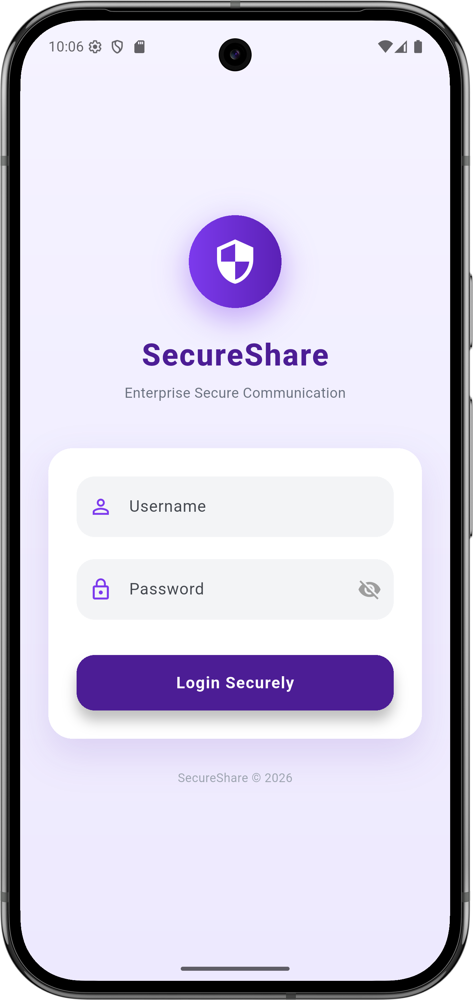
    </a>
    &nbsp;&nbsp;&nbsp;&nbsp;

<a href="Docs/AdminPanel.png">
    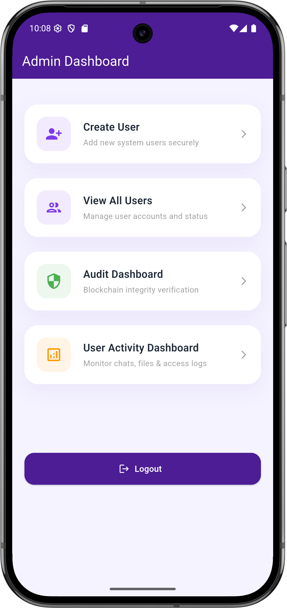
</a>
&nbsp;&nbsp;&nbsp;&nbsp;

<a href="Docs/CreateUserPage.png">
    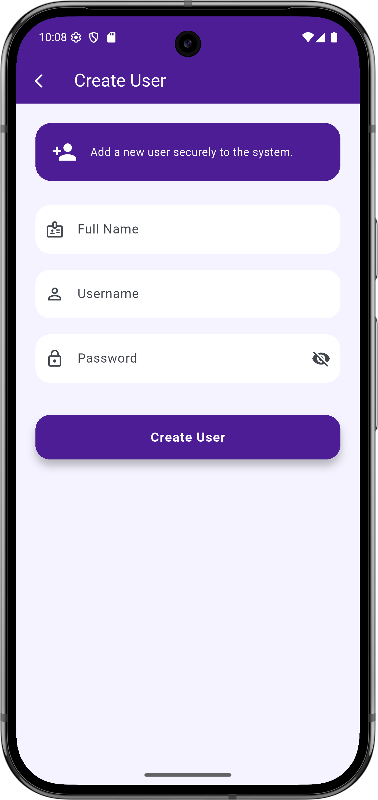
</a>

 

    <a href="Docs/UserData.png">
        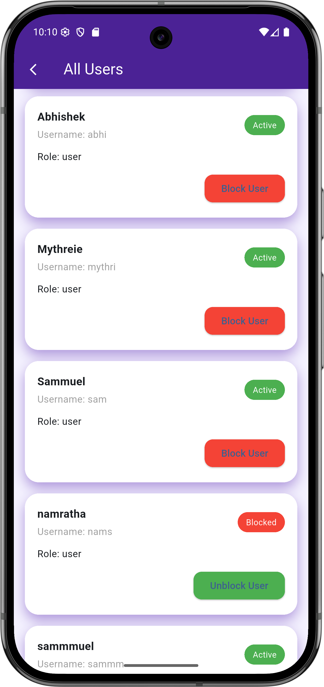
    </a>
    &nbsp;&nbsp;&nbsp;&nbsp;

<a href="Docs/AuditDashboard.png">
    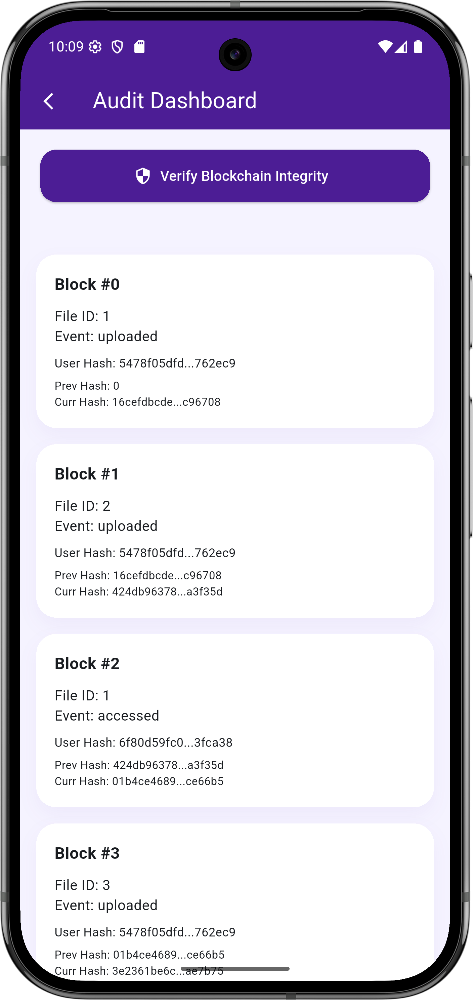
</a>
&nbsp;&nbsp;&nbsp;&nbsp;

<a href="Docs/UserActivityDashboard.png">
    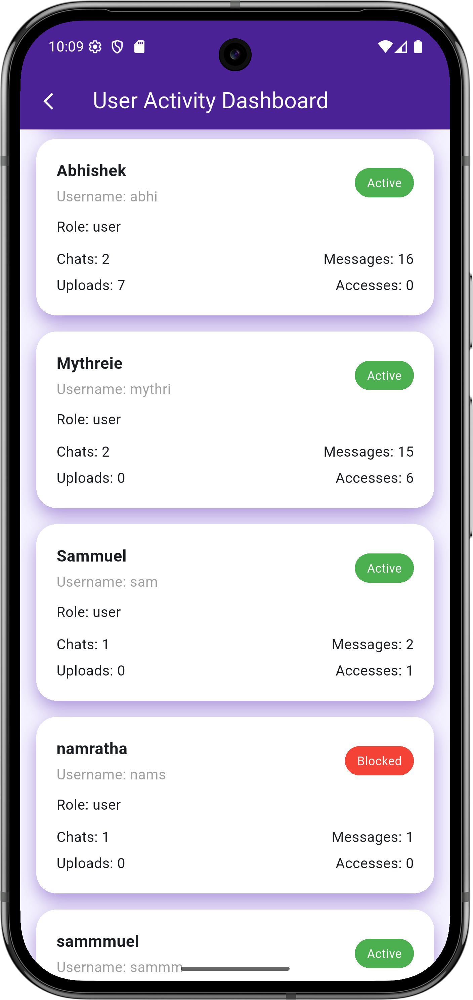
</a>

 

    <a href="Docs/UserHomeScreen.png">
        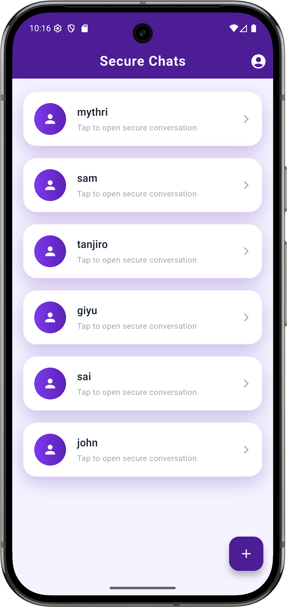
    </a>
    &nbsp;&nbsp;&nbsp;&nbsp;

<a href="Docs/CreateChat.png">
    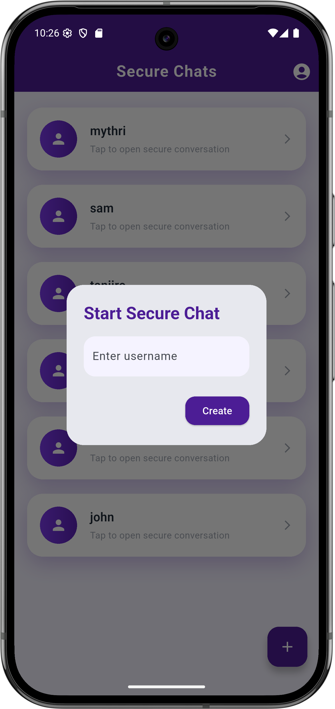
</a>
&nbsp;&nbsp;&nbsp;&nbsp;

<a href="Docs/ChatScreen1.png">
    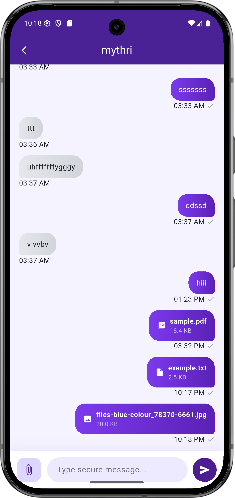
</a>

 

    <a href="Docs/ChatScreen2.png">
        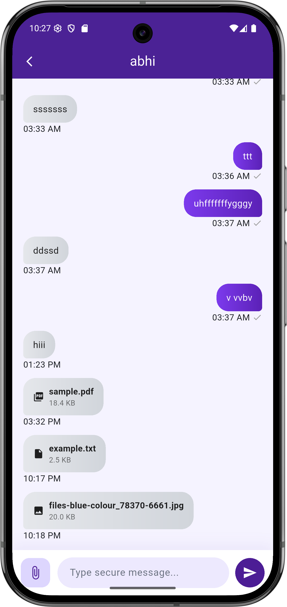
    </a>
    &nbsp;&nbsp;&nbsp;&nbsp;

<a href="Docs/UploadScreen.png">
    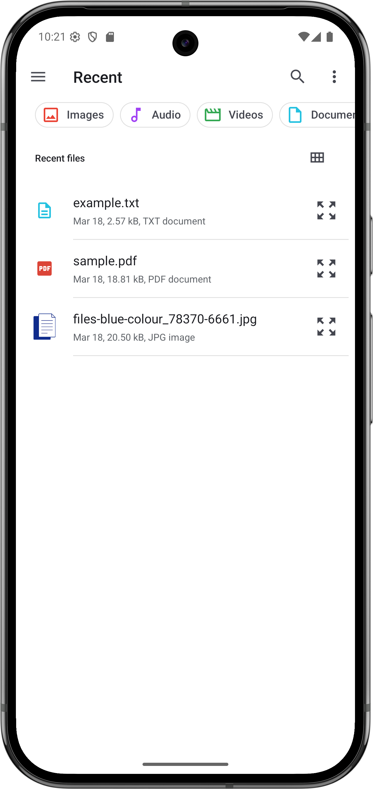
</a>
&nbsp;&nbsp;&nbsp;&nbsp;

<a href="Docs/FileSharingSetting.png">
    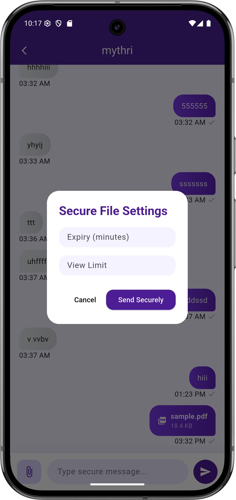
</a>

 

    <a href="Docs/ImageFileViewer.png">
        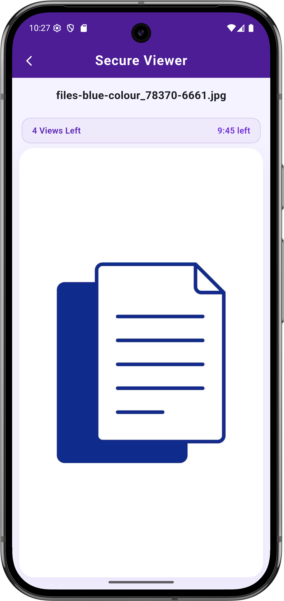
    </a>
    &nbsp;&nbsp;&nbsp;&nbsp;

<a href="Docs/TextFileViewer.png">
    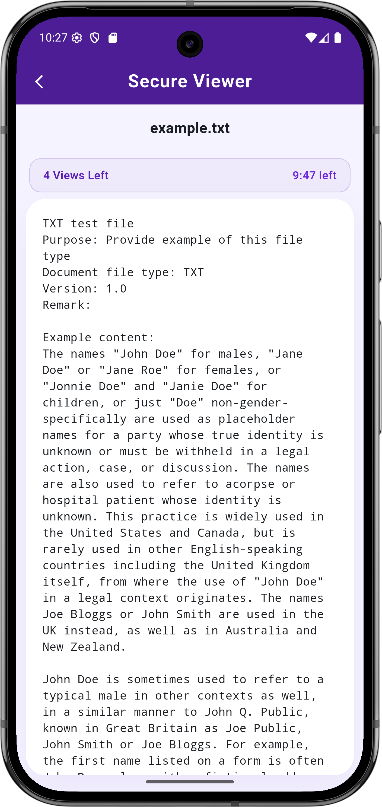
</a>
&nbsp;&nbsp;&nbsp;&nbsp;

<a href="Docs/FileAccessDenied.png">
    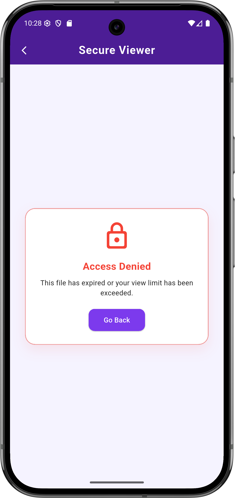
</a>

 

    <a href="Docs/ProfilePage.png">
        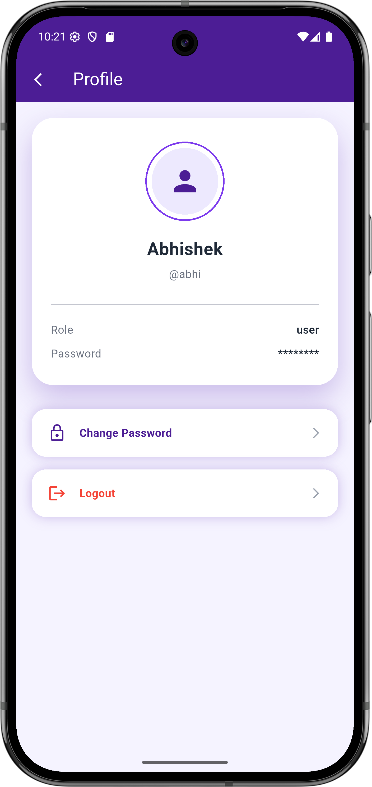
    </a>
    &nbsp;&nbsp;&nbsp;&nbsp;

<a href="Docs/ChangePassword.png">
    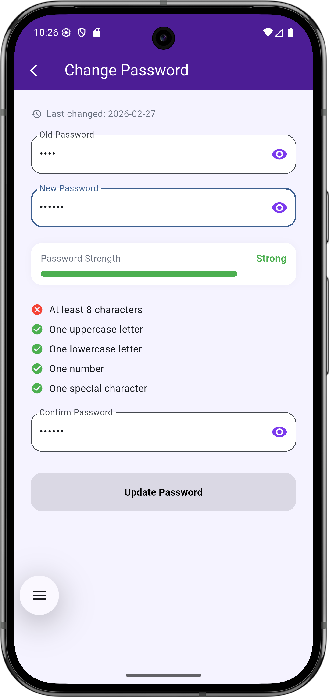
</a>

 

  <i>SecureShare – Intelligent Decentralized Secure File Sharing System with Privacy-Preserving Access Control</i>

---

## Demo Video

Watch the working demonstration of SecureShare:

[▶ Watch Demo Video](https://youtu.be/XsRCdOI1mLQ)

---

## Project Outcomes

* Developed a secure decentralized file-sharing framework.
* Eliminated dependency on centralized storage.
* Improved access control and accountability.
* Enhanced privacy through cryptographic protection.
* Demonstrated practical integration of blockchain and IPFS.
* Implemented intelligent monitoring for threat detection.

---

## Future Enhancements

* Shamir Secret Sharing for distributed key management
* Advanced Zero-Knowledge Proof authentication
* Federated identity management
* Multi-chain blockchain support
* AI-driven threat intelligence
* Secure document viewer with screenshot prevention
* Cloud-scale deployment

---

## Academic Publication

This project contributed to research in decentralized secure file sharing and privacy-preserving access control mechanisms.

---

## Project Team

Developed by:

- Mythreie Dumpati
- Abhishek Mathpati

Department of Computer Science & Engineering  
Keshav Memorial Engineering College

---

## License

This repository is intended for academic and project showcase purposes only.

Source code is not publicly available.
